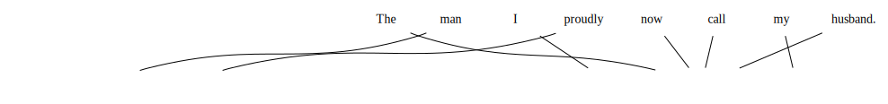
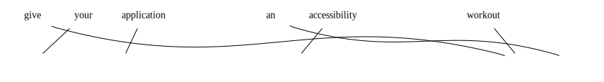

# IBM Model-1 

- Have imported the model from NLTK library. 
- Read the source and target files from the parallel corpus of translation from translation tools T1-T5 Translation. 
- AlignedSent : used for the inputing the sentence as parallel corpus
- Trained model for the above translations.
- Check the alignment for the given sentence/word.


```python
from nltk.translate.ibm1 import IBMModel1
from nltk.translate import AlignedSent


def get_text(filename):
    sentences = []
    with open(filename,'r') as f:
        for sentence in f:
            sentences.append(sentence.split())
    return sentences

src_sentences = get_text('source.txt')
trg_sentences = get_text('target.txt')

bitext = []
for i in range(len(src_sentences)):
    bitext.append(AlignedSent(src_sentences[i], trg_sentences[i]))

ibm1 = IBMModel1(bitext, 25)
```

Model is trained, now checking the alignment of sentences.


```python
test_sentence = bitext[112]
print(test_sentence.words)
print(test_sentence.mots)
print(test_sentence.alignment)
```

    ['The', 'man', 'I', 'proudly', 'now', 'call', 'my', 'husband.']
    ['जिस', 'आदमी', 'को', 'मैं', 'गर्व', 'से', 'अब', 'अपने', 'पति', 'को', 'बुलाती', 'हूं।']
    0-10 1-1 2-3 3-4 4-10 5-10 6-11 7-10


```python
test_sentence
```


    

    


```python
bitext[200]
```


    

    


Checking the probability of words with respect to possible translation word.

For below example Education with देती has less probability compared to शिक्षा .


```python
print(ibm1.translation_table['Education']['देती'])  
print(ibm1.translation_table['Education']['शिक्षा']) 
print(ibm1.translation_table['education']['शिक्षा']) 
```

    5.0307245858507765e-05
    0.006388708326959395
    0.7571975658852016


From the above we can see that the since the IBM model data considers words based on their case (small,captial).
We see the probability of word **Education** is less for शिक्षा compared to that of **education**.

## Will be training the model with small character words only.


```python
str="Hello this Is cpas"
str.lower().split()
```


    ['hello', 'this', 'is', 'cpas']


```python
from nltk.translate.ibm1 import IBMModel1
from nltk.translate import AlignedSent


def get_text(filename):
    sentences = []
    with open(filename,'r') as f:
        for sentence in f:
            sentences.append(sentence.lower().split())
    return sentences

src_sentences = get_text('source.txt')
trg_sentences = get_text('target.txt')

bitext = []
for i in range(len(src_sentences)):
    bitext.append(AlignedSent(src_sentences[i], trg_sentences[i]))

ibm1 = IBMModel1(bitext, 25)
```


```python
test_sentence = bitext[112]
print(test_sentence.words)
print(test_sentence.mots)
```

    ['the', 'man', 'i', 'proudly', 'now', 'call', 'my', 'husband.']
    ['जिस', 'आदमी', 'को', 'मैं', 'गर्व', 'से', 'अब', 'अपने', 'पति', 'को', 'बुलाती', 'हूं।']


```python
bitext[200]
```


    

    


```python
print(ibm1.translation_table['education']['देती'])  
print(ibm1.translation_table['Education']['शिक्षा']) 
print(ibm1.translation_table['education']['शिक्षा']) 
```

    3.330100109356462e-10
    1e-12
    0.8518049777732073


We observe better probability with lower case conversion

# Code implementation of IBM Model -1

- Read the files
- Defined function for translation based on calculated probability ( ref functions: https://www.nltk.org/api/nltk.translate.ibm1.html )
- provide the test dataset from hindi to english translation, output the translated text file


```python
file = open('./source.txt', 'r', encoding="utf8")
train_en = file.read()
raw_sentences_train_en = train_en.split("\n")

file = open('./target.txt', 'r', encoding="utf8")
train_hi = file.read()
raw_sentences_train_hi = train_hi.split("\n")

file = open('./bingHindi.hi', 'r', encoding="utf8")
test_en = file.read()
bing_hindi_hi = test_en.split("\n")

```


```python
def translate_sentence(sentence, tef, file):
    '''
    takes the best translation of an hindi word
    and appends to eng sentence
    '''
    global predicted_eng
    eng_sentence = []
    print("hin:",sentence)
    
    tokens = sentence.split(" ")
    for idx, token in enumerate(tokens):
        probabilities = []
        eng_words = []

        max_score = -1
        max_eng_word = ""
        for k, v in tef.items():
            if token == k[0]:
                probabilities.append(v)
                eng_words.append(k[1])
        for tef_index, prob in enumerate(probabilities):
            if prob > max_score:
                max_score = prob
                max_eng_word = eng_words[tef_index]
        
        eng_sentence.append(max_eng_word)

    eng_sentence = " ".join(eng_sentence)
    print("eng:", eng_sentence)
    file.write(eng_sentence)
    file.write("\n")
    
    return eng_sentence

```


```python
def test_model(dataset, tef):
#     tef = np.load('./models/IBMmodel1tef.npy')
    file = open("dev_translations.txt", 'w+')
    translated_data = []
    for sentence in dataset:
        translation = translate_sentence(sentence, tef, file)
        translated_data.append(translation)
    
    file.close()
    return translated_data
```


```python
def make_lower_case(data):
    list_ = []
    for sentence in data:
        list_.append("NULL " + sentence.lower())
#     print(list_[2])
    return list_
```


```python
sentences_train_en = make_lower_case(raw_sentences_train_en)
```


```python
for i in range(5):
  print(i,sentences_train_en[i])
```

    0 NULL education means to study the subjects for deeper knowledge and to understand the various subjects which are going to use in our daily life.
    1 NULL the term education is not limited to our bookish knowledge but it stands for knowledge that is obtaining and experiencing by us outside the books or classrooms.
    2 NULL education changes our perspectives to see life.
    3 NULL education in our life starts from our childhood which is began at home and education is a lifelong process which is going to end with our death or maybe if there is any after-death life, it will also remain continuous there.
    4 NULL in this topic, we will talk about the importance of education in our life, why is education so important, why is education important to society, the role of education in our life, what is the importance of education in our life and the importance of school education.


```python
def is_converged(new, old, epoch):
    epsilone = 0.00000001
    if epoch < 15:
        return False
    return True
```


```python
from collections import defaultdict
def perform_EM(en_sentences, hi_sentences):
    
    uni_ini = 0.00001
    
    translation_prob = defaultdict(lambda: float(uni_ini))
    translation_prob_prev = defaultdict(float)
    
    epoch = 0
    
    while True:

        epoch += 1
        print("epoch num:", epoch,"\n")
        count = defaultdict(float)
        total = defaultdict(float)
        s_total = defaultdict(float)
        
        for index_sen, hin_sen in enumerate(hi_sentences):
            #compute normalization
            hin_sen_words = hin_sen.split(" ")
            for hin_word in hin_sen_words:
                s_total[hin_word] = 0
                eng_sen_words = en_sentences[index_sen].split(" ")
                for eng_word in eng_sen_words:
                        s_total[hin_word] += translation_prob[(hin_word, eng_word)]
            
            #collect counts
            for hin_word in hin_sen_words:
                eng_sen_words = en_sentences[index_sen].split(" ")
                for eng_word in eng_sen_words:
                        count[(hin_word, eng_word)] += translation_prob[(hin_word, eng_word)]/s_total[hin_word]
                        total[eng_word] += translation_prob[(hin_word, eng_word)]/s_total[hin_word]                   

        #estimate probabilities
        for (hin_word, eng_word) in translation_prob.keys():
                translation_prob[(hin_word, eng_word)] = count[(hin_word, eng_word)]/total[eng_word]

        if is_converged(translation_prob, translation_prob_prev, epoch) == True:
            break
        
        translation_prob_prev = translation_prob
        
        
    return translation_prob

```


```python
def train_model(sentences_train_en, sentences_train_hi):
    
    translation_prob = perform_EM(sentences_train_en, sentences_train_hi)
    return translation_prob

```


```python
tef = train_model(sentences_train_en, raw_sentences_train_hi)
```

    epoch num: 1 
    
    epoch num: 2 
    
    epoch num: 3 
    
    epoch num: 4 
    
    epoch num: 5 
    
    epoch num: 6 
    
    epoch num: 7 
    
    epoch num: 8 
    
    epoch num: 9 
    
    epoch num: 10 
    
    epoch num: 11 
    
    epoch num: 12 
    
    epoch num: 13 
    
    epoch num: 14 
    
    epoch num: 15 
    


```python
def translate_sentence(sentence, tef, file):
    '''
    takes the best translation of an hindi word
    and appends to eng sentence
    '''
    global predicted_eng
    eng_sentence = []
    print("hin:",sentence)
    
    tokens = sentence.split(" ")
    for idx, token in enumerate(tokens):
        probabilities = []
        eng_words = []
        max_score = -1
        max_eng_word = ""
        for k, v in tef.items():
            if token == k[0]:
                probabilities.append(v)
                eng_words.append(k[1])

        for tef_index, prob in enumerate(probabilities):
            if prob > max_score:
                max_score = prob
                max_eng_word = eng_words[tef_index]
        
        eng_sentence.append(max_eng_word)
    
    eng_sentence = " ".join(eng_sentence)
    print("eng:", eng_sentence)
    file.write(eng_sentence)
    file.write("\n")
    
    return eng_sentence

```


```python
def test_model(dataset, tef):
    file = open("source_write.txt", 'w+')
    translated_data = []
    for sentence in dataset:
        translation = translate_sentence(sentence, tef, file)
        translated_data.append(translation)
    
    file.close()
    return translated_data
```


```python
predicted_translations = test_model(bing_hindi_hi, tef)
```

    hin: शिक्षा का अर्थ है गहन ज्ञान के लिए विषयों का अध्ययन करना और उन विभिन्न विषयों को समझना जो हमारे दैनिक जीवन में उपयोग करने जा रहे हैं।
    eng: education of deeper is deeper knowledge well them subjects of study him, and disabled various subjects parse deeper who our daily life teaching use befor going core: studies.
    hin: शिक्षा शब्द हमारे किताबी ज्ञान तक सीमित नहीं है, बल्कि यह ज्ञान के लिए खड़ा है जो पुस्तकों या कक्षाओं के बाहर हमारे द्वारा प्राप्त और अनुभव कर रहा है।
    eng: education word our bookish knowledge until: limited act life, treat this knowledge well them bookish is who books or nowadays, well out our by books and experiences planned always us
    hin: शिक्षा जीवन को देखने के लिए हमारे दृष्टिकोण को बदल देती है।
    eng: education life parse viewing well them our perspectives parse perspectives perspectives us
    hin: हमारे जीवन में शिक्षा हमारे बचपन से शुरू होती है जो घर पर शुरू होती है और शिक्षा एक आजीवन प्रक्रिया है जो हमारी मृत्यु के साथ समाप्त होने जा रही है या शायद मृत्यु के बाद कोई जीवन है, तो वह वहां भी निरंतर बनी रहेगी।
    eng: our life teaching education our childhood manages starting starts is who home on starting starts is and education one starts process… is who financial childhood well with conclude tell going growing is or starts childhood well finally has life life, possibilities he explained also strength. starts starts
    hin: इस विषय में हम अपने जीवन में शिक्षा के महत्व के बारे में बात करेंगे, शिक्षा इतनी महत्वपूर्ण क्यों है, शिक्षा समाज के लिए क्यों महत्वपूर्ण है, हमारे जीवन में शिक्षा की भूमिका, हमारे जीवन में शिक्षा का महत्व क्या है और स्कूली शिक्षा का महत्व क्या है।
    eng: thirty subject teaching we his life teaching education well importance well consider teaching talked topic, education why important why life, education society. well them why important life, our life teaching education exactly topic, our life teaching education of importance whether is and importance education of importance whether us
    hin: यह विषय जीवन में शिक्षा के महत्व को जानकर सकारात्मक विचारों के साथ आपके दिमाग को बढ़ावा देगा।
    eng: this subject life teaching education well importance parse boost boost boost well with you. mind parse boost boost
    hin: तो, चलो विषय के साथ शुरू करते हैं।
    eng: let’s let’s subject well with starting work studies.
    hin: शिक्षा क्या है।
    eng: education whether us
    hin: यह एक महत्वपूर्ण उपकरण है जो किसी व्यक्ति को अपने परिवार, समाज के साथ-साथ अपने देश के प्रति अपने अधिकारों और कर्तव्यों को जानने में सक्षम बनाता है।
    eng: this one important tools is who aspects person parse his enables society. well enables his country well independent his enables and enables parse enables teaching enabled bonding us
    hin: यह दुनिया को देखने के लिए एक व्यक्ति की दृष्टि विकसित करता है और अन्याय, भ्रष्टाचार, हिंसा आदि जैसी गलत चीजों के खिलाफ लड़ने की क्षमता भी विकसित करता है।
    eng: this world parse viewing well them one person exactly develops moral creates is and develops develops develops violence, violence, bug! seventy-one well against develops exactly ability also moral creates us


```python

```

# Conclusion:

- We might want to apply the alignment models to this larger dataset, and need to do sentence alignment to discard any sentences that aren't aligned 1:1 (as Model 3 & above handels NULL alignment well).
- Lower-case the dataset, which keeps the vocabulary small enough for reasonable runtime and robust estimation.
- Only alignment doesn't necessarily provide better translation, doesn't consider grammar.


```python

```
