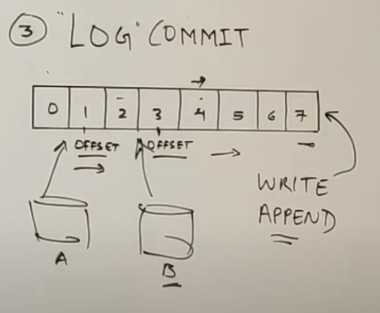

# Kafka

Originally developed by LinkedIn, Kafka was opened sourced in 2011 to the Apache Software Foundation where it graduated from the Apache Incubator on October 23rd, 2012. The distributed event store and streams-processing platform was named after the author Franz Kafka by its lead developer, Jay Kreps, because it is a “system optimized for writing.”

ZooKeeper, on the other hand, was originally developed by Yahoo in the early 2000s, and started out as a Hadoop sub-project. It was originally developed to manage and streamline big data cluster processes and fix bugs that were occurring during the deployment of distributed clusters. In 2008, it was gifted to the Apache Software Foundation and was promoted soon thereafter to a top-level ASF project.

## What Is Apache Kafka?

Kafka is a distributed event store and streams-processing platform, meaning simply it takes data from producers and streams them out to consumers.

## Kafka Brokers

The main vehicle for this movement of data is the Kafka broker. The Kafka broker handles all requests from all clients (both producers and consumers as well metadata). It also manages replication of data across a cluster as well as within topics and partitions.

## Kafka Topics

A Kafka topic is a grouping of messages that is used to organize messages for production and consumption. A producer places messages or records onto a given topic, then a consumer reads that record from the same topic. A topic is further broken down into partitions that house a number of records, each identified as a unique offset in a partition log.  

These records are stored in an unchangeable sequence so that records can be spread across multiple Kafka partitions as well as multiple brokers.
This parallelism is what allows multiple consumers to read simultaneously across an entire cluster, and read consumer records at a rate ranging from 10's to 100,000's of records per second.
The functionality makes Kafka second to none when it comes to sheer speed and throughput.

To coordinate all this flow data between consumers, producers, and brokers, Kafka leverages Apache ZooKeeper.

## Log Data Structure

Key terms

        kafka Cluster
        |
        |
        kafka server==kafka broker

### 1. Topics

* A stream of messages belonging to a particular. category is called a topic.
* It is a logical feed name to which records are published.
* Similar. to a table in a database. (records are considered messages here.)
* Jnique identifier of a topic is its NAME.
* We can create as many topics as we want.

1. 1 Partition

* Topics are split in Partitions.
* All the messages within a partition are ordered
Ind immutable.
* Each message within a partition has a unique ld
* Associated known as Offset.

### Kafka Broker

 It is a server that manages and stores Kafka messages or records. Each broker in a Kafka cluster is responsible for handling a portion of the data and providing services to producers and consumers that connect to it.

Kafka brokers store the messages in partitions, which are a unit of parallelism for Kafka topics. A partition is a logical unit of data that contains a subset of the total data in a topic, and each partition is stored on one or more brokers. When a producer sends a message to a Kafka topic, the message is written to one of the available partitions, based on the partitioning strategy configured for the topic.

1. 2 Replication

Partition = 3
Replication factor = 2

Replicas are backups of a partition.
Replicas are never read or write data.
They are used to prevent data loss. (Fault-
Tolerance)

## **Partition** 

Producers are applications which write/publish data to the topics within a
cluster using the Producing APIs.
Producers can write data either on the topic level(All the partitions of
that topic) or specific partitions of the topic.

## **Consumer**

Consumers are applications which read/consume data from the topics
within a cluster using the Consuming APIs.
Consumers can read data either on the topic level(AII the partitions of
that topic) or specific partitions of the topic.
Consumers are always associated with exactly one Consumer Group.
A Consumer Group is a group of related consumers that perform a task.

## **Broker**

Brokers are simple software processes who maintain and manage the
published messages.
Also known as kafka servers.
Brokers also manage the consumer-offsets and are responsible for the
delivery of messages to the right consumers.
A Set of brokers who are communicating with each other to perform the
management and maintenance task are collectively known as Kafka
Cluster.
We can add more brokers in a already running kafka cluster without any
downtime.

## **Zookeeper**

Zookeeper is used to monitor kafka Cluster and co-ordinate with each
broker.
Keeps all the metadata information related to kafka cluster in the form of
a key-value pair.
Metadata includes
1. Configuration information.
2. Health status of each broker.
It is used for the controller election within kafka cluster.

A Set of Zookeepers nodes working together to manage other
distributed systems is known as Zookeeper Cluster or "Zookeeper
Ensemble".

## **Features**

1. Scalable.
Horizontal Scaling is done by adding new brokers to the existing clusters.
2. Fault Tolerance.
Kafka clusters can handle failures because of its distributed nature.
3. Durable.
Kafka uses "Distributed commit log" which means messages persists on disk
as fast as possible.
4. Performance
Kafka has high throughput for both publishing and subscribing messages.
5. No Data loss
It ensures no data loss if we configure it properly.
6. Zero Down Time
It ensures zero downtime when required number of
present in the cluster.
7. Reliability
20:35
Kafka is reliable because it provides above features.

# Demo

