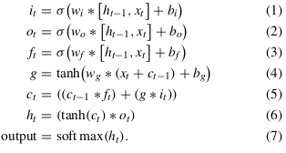
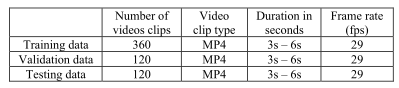
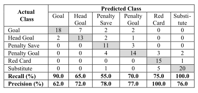
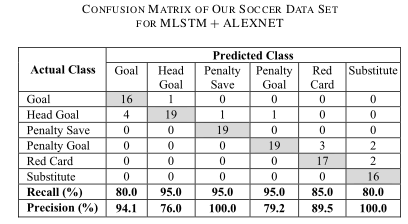
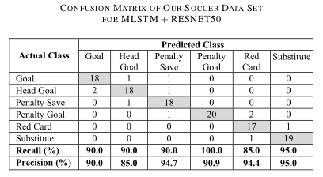
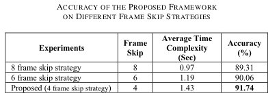

# AI-Driven Salient Soccer Events Recognition Framework for Next-Generation IoT-Enabled Environments

**Salient** : most noticeable or important

**Nx-IoT**: The rapid advancement of the Internet of Things (IoT) in real-world applications has attracted immense research endeavors in the last few years. It has got tremendous potential in industrial automation and various other fields. The use of IoT has changed the perspective of general applications in today’s world. In this article, a next-generation architecture, Nx-IoT, is proposed for conventional 6LoWPAN-based IoT. The proposed Nx-IoT architecture works in two modes: 
1) single controller-based (6SSDx) and 
2) multicontroller-based (6MSDx). 

The Nx-IoT architecture uses new algorithms for routing management and load distribution among the SDN controllers. The experimentation is carried out in a prototype testbed environment. The result shows improved performances in terms of round trip and packet drop, compared to the conventional 6LoWPAN and cloud system. The proposed Nx-IoT architecture reduces the latency and shows better throughput performances as compared to the existing state of the art.

Refer: [Nx-IoT: Improvement of Conventional IoT Framework by Incorporating SDN Infrastructure](https://ieeexplore.ieee.org/document/9924184)

## Abstract

- Important(salient) event recognition of soccer matches in Nx-IOT : Aims to analyze perfomance of players/teams by sport analytics.
- Nx-IOT devices carried by players during match, captures & transmit data.
- Interconnectivity of data acquisition devices with AI & Nx-IOT will allow spectators and managers to evaluate the player's performance.
- Nx-IoT enabled salient event detection feature to be provided as FinTech service.
- In this paper DL based framework for multiperson salient soccer event recoginition in IOT enabled Fintech.
- Proposed framework perform event regonition in three step:
    1. frames prepocessing
    2. frame level discriminative feature extraction
    3. high level event recognition in soccer video

- SVE (Soccer Video Events) dataset with 6 salient events of a game.
- Evaluated SV dataset using traditional Ml & DL algorithms.
- Also performed event recognition on untrimmed soccer video using proposed framework and compared results.

- Terms: CV,CNN,Edg Computing, Event recognition, Multilayer Long Short-term memory (MLSTM), Nx-IoT

## Introduction

The noticeable advancement in networking technolo-
gies and efficient deep learning algorithms over edge
devices has allured the sports industry to adopt next-
generation Internet of Things (Nx-IoT)-enabled financial tech-
nology (FinTech) services for a wide range of applications.

The Nx-IoT devices in
sports communicate and transmit data with other IoT/edge
devices for edge-centric distribution and processing of sports
data.

Sports organizations, especially soccer officials,
provide edge-based IoT environments, which can significantly
improve the quality of sport analytics systems and enable
the spectators to have a more enjoyable interactive expe-
rience.

The video data captured by the vision sensors can
be instantly processed over edge devices and then trans-
mitted to artificial intelligence (AI)-assisted edge computing
platforms for a variety of applications, such as event detec-
tion/recognition, player identification, and players formation
tracking in the field of a soccer stadium equipped with Nx-
IoT.

Due to the exponential growth of fans following, soccer
has become the world’s most watchable sport with more than
4.0 billion audience worldwide

According to a recent
report (Google: Watch time for YouTube sports highlights
jumps 80%), 90% of online viewers search for soccer videos
highlights or prefers to access salient sports events (such as
goal, penalties, fouls, corner-shots, etc.) rather than watching
full matches.

The Nx-IoT-enabled
edge-based event recognition service in soccer stadiums can
improve the experiences of live spectators by providing an
interactive entertainment environment.

Event recognition is an essential component for high-level
sports video analytic tasks, such as event-aware highlights
generation

Soccer events are different from
other sports events, where a video clip contains fascinating
contents for a random time interval with semantically(logical) starting and ending boundaries of events rather than a fixed time
interval. 
- For instance, in counterattack, the brilliant assist
before the goal and the celebrations after the goal are the com-
plete soccer events.
- All these events are high-level semantics,
which can be recognized with multiscale deep features (i.e.,
extract convolutional neural network (CNN) features at differ-
ent layers with varying spatial dimensionality). For instance,
in the soccer match, a goal is an event that involves differ-
ent movements of the human body, such as running, jumping,
passing ball, and shooting ball toward goalmouth.

Earlier Researches:
- for soccer event detection
and recognition were based on low-level or handcrafted visual
features and traditional machine learning algorithms. These
low-level feature-based methods rely on global features, includ-
ing the texture, edge, color, shape, and motion information.
- Although these methods made some achievements in the last
decade, they could only detect few soccer events and usually
failed for complex type of events with a clutter background.
- To decrease(minimise) semantic gap between the low-level seman-
tics and high-level semantics, several traditional soccer event
detection methods have been proposed
- These methods utilized
mid-level features to obtain the intermediate representation of
soccer events, including field view classification, player track-
ing, scoreboard detection, and play–break segmentation.
- Earlier work first extracted the excitement
clip from lengthy videos, and then detected the salient events
using histogram and color computations. In addition, these
earlier methods often required additional information such as
text from score boards and audio commentary related to the
game play. Despite, acquiring additional information about
game, the results achieved by these methods still suffered from
misclassification for complex events.

Besides the existence
of smart embedded devices and energy-friendly deep learning
architectures, it is very crucial to have a sufficient amount of
data for the problem/task under consideration. The availabil-
ity of problem-related data sets greatly helps the researchers
to train and evaluate their proposed systems without devoting
considerable efforts on generating new data sets.
- existing data sets are very specific and doesn't cover the salient events of soccer.

In this article, author has presented an efficient deep
learning-based framework for salient soccer event recognition
over edge-centric FinTech computing platform and their newly
created soccer videos events (SVE) data set.

The proposed
framework performs event recognition process in three steps:
1) preprocessing: 

    image frames are extracted from video streams and resized to match the input of the deep network.

2) features extraction

    framework uses a pretrained CNN
    architecture, which extracts deep discriminative features from
    the video frames.

3) sequence learning

    a multilayer LSTM is used to analyze the video stream by capturing the temporal relation between adjacent frames.

SVE data set contains short duration clips of six different soccer events.

The key contributions of
our scheme can be summarized as follows.
1) To recognize the salient events in soccer matches, we
investigated traditional machine learning (HOG+SVM)
and deep learning-based approaches (CNN+MLSTM)
for FinTech-enabled soccer event recognition service and
propose an energy-efficient CNN+LSTM framework.
Our proposed framework strikes a tradeoff between
computational complexity and model accuracy and is
a suitable solution for edge-centric FinTech computing
platforms and similar domains associated with Nx-IoT
environments, showing its flexibility and scalability

2) The literature contains very few data sets for soccer
event detection/recognition. However, there is no bench-
mark data set of key events, which defines the interest
of live/offline spectators. We have created our own SVE
data set, which contains salient events of soccer matches
captured from multiple views. The SVE data set is pub-
licly available for further research to mature the event
detection/recognition systems for soccer videos.

3) Author have conducted comprehensive experiments on our
newly created SVE data set to evaluate the performance of
our framework. Furthermore, we have tested the proposed
framework on relevant events from other data sets and
have conducted a comparative study. The obtained results
reveal that the proposed framework generalizes well and
performs better than existing methods.

# Related Work

soccer event
recognition methods can be categorized into two parts: 
1) low-level features-based
2) deep learning-based methods

## 1. Low-Level Features-Based Event Recognition Approaches

Event recognition has played a very important role in different domains of sports video content analysis, including
highlight generation, event-based sports video retrieval, and
statistical summary generation of sports videos.

These methods usually used handcrafted descriptors and
machine learning classifiers for feature extraction and classi-
fication,

**Kolekar and Sengupta** proposed an automatic highlight generation system that could
generate highlight from sports TV broadcasts.
First, they
detected the exciting clips using audio features and then seg-
mented the clips into different scenes. Next, they assigned a
concept-score to each scene within a clip using a probabilis-
tic Bayesian belief network (PBBN) and selected the scene
with a higher concept-score.

**Wang**
proposed a soc-
cer video annotation framework based on coarse-grained time
information. They annotated the soccer events by synchro-
nizing the video clips and external text information (match
reports) with coarse time constraints.

**Fakhar**
presented a learning-based soccer event detection approach
based on two main concepts. First, they analyzed the frame
and estimated the saliency of each frame regarding soc-
cer events. Second, the event-oriented and discriminative
dictionary was learned using their proposed K-SVD algo-
rithm.

However, these handcrafted or low-features-based
methods are less effective and time consuming for detect-
ing high-level soccer events. These limitations can create
issues when processing lengthy videos or dealing with sports
TV broadcasts. Besides these traditional handcrafted-based
methods, numerous learning-based event detection/recognition
methods have been proposed, which significantly improve
the event detection and recognition task and overcome the
limitations of traditional methods.

## 2. Deep-Learning-Based Event Recognition Approaches

CNN-oriented methods have achieved greater suc-
cess and have improved the performance of various computer
vision tasks, including image classification,object
detection, image enhancement and activity recognition.

**Jiang**
proposed a deep learning-
based approach for soccer video event detection. Their method
utilized the combination of CNN and RNN, where they
segmented the soccer video in play–break segments by deter-
mining the event boundary, and then extracted CNN features
of key frames from play–break segments. Finally, RNN was
deployed to recognize the salient soccer events, including
the goal, goal attempt, card, and corner.

**Tsunoda**
presented a hierarchical RNN for analyzing the understanding between players of team sports activity. They integrated
multiple person-centered features with LSTM cell output over
temporal sequences.

These deep learning-based approaches have shown remarkable performance and have effectively overcome the limitations of low-level features-based methods. On the other hand, these deep learning-based approaches require high computation power for training purposes. Different from the existing methods, authors proposed framework efficiently reduces the computational complexity by adopting transfer
learning and frame skip strategies.

# Proposed Framework

Human action-oriented events typically involve sequences
of specific human postures evolving in video frames, which
demonstrate variations in both spatial and temporal domains.
For example, the goal event in soccer consists of more than
one action where each action is the combination of different postures of human body. While analyzing the soccer
video, these high-level actions can be visualized as hidden
sequential patterns, which can be detected and recognized
with strong representation (high-level features).

Author propose a deep learning-based salient event recognition
framework, which analyzes the input soccer video using
CNN with MLSTM. The proposed framework comprises of
three steps.

**Step 1 (Preprocessing):** The preprocessing step extracts the
image frames from the video stream and resize the frames to
match the input of the deep neural network.

**Step 2 (Feature Extraction):** In the feature extraction step,
our framework extracts deep features using a pretrained CNN
network from the sequence of frames.

**Step 3 (Sequence Learning):** In the third step, the extracted
features are fed into an MLSTM to retrieve high-level abstrac-
tion and temporal information for the event recognition task.

1. Preprocessing : frames are extracted from the
video with three different frame skip strategies and then
resized each frame to match the input of the deep neural
network. In our proposed framework, the input is resized to
224 × 224 × 3 to match the input layer dimensionality of the
ResNet50 architecture.

2. Features Extraction Using ResNet50 Architecture: Soccer event is the combination of multiple actions
(running, jumping, and passing, etc.), where each action is
itself the integration of different poses. The event recognition workflow starts from low-level semantics extraction (actions)
to high-level semantics (events). To represent these sequences
of actions, CNN features from each frame are expressed as an
individual feature vector.
Similarly, the complete video can be
represented as a set of feature vectors having a sequential rela-
tion between the adjacent feature vectors.

CNN is originally introduced for the image classification
task and has achieved state-of-the-art results.
 It has the
ability to extract features of different scales and is equipped
with a classifier at the end of architecture.
 CNNs are widely used for a variety of high-level computer vision tasks. The main reason behind the success and achievements of CNNs is
the hierarchical nature of the architecture that contains a series
of layers, including convolution, pooling, and fully connected layers.

The convolutional layer generates different representa-
tions of the same image by convolving different kernels with
different sizes. The pooling layer subsamples the input feature
maps by selecting the high activations values, while the fully
connected layer learns high-level representations and reshapes
the input feature maps to a 1-D feature vector.

Training a new
CNN architecture from the scratch requires a huge amount of
image data along with powerful machines for execution, such
as graphics processing units (GPUs) or tensor processing units
(TPUs). This problem can be addressed using transfer learning
strategy where a pretrained model is utilized for another com-
puter vision problem.

ResNet50 trained with ImageNet data set containing more than 20 000 categories.

The first layer of the
ResNet50 architecture is input layer with dimensionality of
224 × 224 × 3, and the second layer is the convolution layer
with a kernel size of 7×7. The rest of the architecture has four
residual blocks, fully connected layers, and a Softmax layer.
Each residual block contains three convolutional layers with
kernel sizes of 1×1 and 3×3 followed by ReLU activation and
Batch Normalization layers.

Each feature
vector represented a single frame of video, these features are
then fed into MLSTM in the form of features block for a fixed
time interval. MLSTM processes these features and learns the
hidden sequential patterns from the input feature data.

3. Event-Specific Sequence Learning Using Multilayer LSTM

CNNs
can only be used for tasks where inputs and outputs have
fixed dimensionality and mostly fail while dealing with the
data having different input and output dimensionality. Along
with this limitation, CNNs are restricted to static data and
cannot be used for problems dealing with time series and
sequential data

To solve sequential pattern learning problems or predicting
time-series data, the need of such a method becomes cru-
cial that can precisely map sequences and learn its hidden
patterns from input time-series data. To meet the needs of
such kind of systems, a special kind of neural network, named
RNN, has been introduced which has the ability to learn from
temporal features and map the temporal relation of a given
time-distributed data.

RNNs are specially designed for the
classification of time-series and sequential data. RNNs ana-
lyze the hidden sequential patterns in both spatial and temporal
dimensions by connecting the previous information with the
current information and predict the future output. The suit-
ability and efficiency of RNN for temporal data analytics has
attracted the research community to investigate it for various
time-series prediction and sequence classification problems
and achieved incredible results. Although RNNs can deci-
pher the hidden sequential patterns in time-series data.

RNNs fail to remember earlier information while interpreting long term sequences. Such
type of problem is known as a vanishing gradient or gradient
exploding, which can be resolved by using a special variant
of RNN known as LSTM, which has the ability to remember
the earlier input information for a long-time interval.

## **Multilayer LSTM Network**

The LSTM is an extension of the RNN architecture, which is specially designed
for interpreting long-term sequences, thereby resolving the
problem of vanishing gradient and gradient exploding faced
by RNNs. The internal structure of LSTM consists of several
cell units, where each cell unit contains special gates (input,
output, and forget gates) that switch the flow of information
and control the sequential pattern recognition process. These
gates are configured in such a way that each gate receives the
input from the previous stage and forwards the computed out-
put to the next gate.

All these gates are controlled by a sigmoid
function. For instance, the input gate ibmt decides that what
portion of information should be updated, whereas the output
gate ot stores the information of the coming sequence. The forget gate ft processes the information from the input gate and
the previous cell state and removes the previous information
from the memory when needed.

The recurrent unit g computes
the previous cell state ct-1 and the current input xt using the
tanh activation function, whereas ht can be computed by multiplying the value of the output gate with tanh of the current
cell state ct. The final output can be obtained by passing the
ht to the softmax classifier.

The performance of any deep neural network can
be improved by stacking more and more layers; similarly, the
hidden sequential pattern leaning capability of an LSTM can
be enhanced by increasing the number of layers in the network.
Therefore, we add three layers to our LSTM network, thereby
increasing the ability to analyze the given input data at different time scales and produce good results as compared to
a standard LSTM. Unlike the standard LSTM, when data are
fed to the MLSTM, the input data are processed in several layers in a hierarchical fashion, where each layer in the network
receives the hidden state of the previous layer as an input
and forwards the output to the next layer.

# EXPERIMENTAL RESULTS AND DISCUSSION

First performed the
salient event recognition using SVM with Histogram of
Oriented Gradient Features descriptor,
and then assessed the performance of different state-of-the-
art architectures with MLSTM for salient event recognition.

**Specification:**
proposed framework is implemented
using MATLAB 2018 with Matconvnet on PC equipped
with 3.60-GHz Intel Core i7 processor and NVIDIA GTX
1080 with 4-GB GPU.

Has initialized the training with a
random weight initializer for 60 epochs with a batch size of
32 . For weight optimization, we have used the Adagrad opti-
mizer with learning rate 0.0001.

For performance evaluation,
author have used five evaluation metrics, including the Precision,
Recall, true-positive rate (TPR), false-positive rate (FPR), and
F1-score.

## Details of the Data Set

SVE data set of soccer videos, which comprises of
short video clips of six different events, including the goal,
penalty save, penalty goal, card, head goal, and substitute.

SVE data set contains event videos
captured from different views with both far and close field of
views that offer great variety in the data. The SVE data set
is created in three distinct phases: 
1) author collect soccer videos
from multiple sources (such as UEFA Champions League,
English Premier League, FIFA World Cup 2018, Bundesliga,
and Primera Division)
2) extract event-specific short video
clips from the downloaded soccer videos
3) annotate the
event-specific video clips with start and end boundary of event.

The SVE data set contains a total of 600 short video clips,
which are divided into three subsets, including train, valida-
tion, and test set with a split ratio of 60%, 20%, and 20%,
respectively.

## Experimental Analysis

1. Experiment 1 (SVM Classifier With Histogram of
Oriented Gradient Features): Authors have evaluated the SVE data
set with a conventional machine learning technique, where we
have used a HOG as a feature descriptor and SVM as a classifier to detect the salient events in soccer videos. The HOG
descriptor represents gradient orientation and magnitude of
objects in a particular region of an image and captures shape-
relevant information of detected objects in a video frame. After
feature extraction process, we have trained the SVM classifier
on extracted features and have evaluated the trained classifier
on the test data set.

These scores can be significantly improved using deep
learning techniques such as CNN and RNN.

2. Experiment 2 (Integration of MLSTM With AlexNet Architecture):

We have analyzed the soccer event recogni-
tion using MLSTM with the AlexNet architecture. First, we
have extracted discriminative CNN features using a pretrained
AlexNet CNN architecture, and then classified the event types
by inputting the extracted features to an MLSTM. For feature extraction, we have used the fully connected layer of pretrained AlexNet model as a generic feature descriptor,
which converts a video frame into a 1 × 4096 feature vec-
tor. After the feature extraction process, MLSTM is trained
on extracted features. Finally, we have evaluated our trained
model on the test data set, where 20 video clips per class are
given to the trained model for the event recognition task.

3. Experiment 3 (Integration of MLSTM With ResNet50 Architecture):

ResNet50 + MLSTM for the recognition of salient events in
soccer videos. Our proposed event recognition framework first
performs a feature extraction process, where we extract CNN
features from video frames using the fully connected layer
fc-1000 of ResNet50. After feature extraction, we have trained
MLSTM on extracted features. Furthermore, we have per-
formed our model testing, where 20 videos per event have
been tested on the trained model.

MLSTM with the ResNet50 architecture not only achieves the
best results in terms of precision and recall but also improves
the overall accuracy on our SVE data set instances, which
are correctly classified.

investigated the performance of the proposed framework using
three different fame skip schemes for event recognition in soccer videos.Proposed four-frame-skip strategy shows overwhelming performance improvement over other
frame skip strategies (i.e., 8-frame-skip strategy and 6-frame-
skip strategy). Therefore, we adopt four-frame-skip strategy in
our approach which enables us to achieve reasonable accuracy
with acceptable time complexity

The results of our proposed
framework are evaluated on test videos of our SVE data set.
To validate the effectiveness of our proposed framework, we
have compared it with five existing soccer event recognition
methods.
It can be observed that the performance of each method varies
from one event to another.
Approaches considered [15], [21], [42].
For instance, the method [21]
has the best accuracy for “Red card” event. Whereas, our
proposed framework dominates the existing soccer event
recognition methods, in particular, for detecting “Goal” and
“Penalty Save or Penalty attempt” events. Our proposed
framework increases the recognition accuracy for “Goal”
and “Penalty save or penalty attempt” events by 1.13% and
3.57%, respectively, on average, as compared to the existing
methods.

**Methods:**

[42] C.-L. Huang, H.-C. Shih, and C.-Y. Chao, “Semantic analysis of soc-
cer video using dynamic Bayesian network,” IEEE Trans. Multimedia,
vol. 8, no. 4, pp. 749–760, Aug. 2006.
[21] M. Tavassolipour, M. Karimian, and S. Kasaei, “Event detection and
summarization in soccer videos using Bayesian network and Copula,”
IEEE Trans. Circuits Syst. Video Technol., vol. 24, no. 2, pp. 291–304,
Feb. 2014.
[15] H. Jiang, Y. Lu, and J. Xue, “Automatic soccer video event detection
based on a deep neural network combined CNN and RNN,” in Proc.
IEEE 28th Int. Conf. Tools Artif. Intell. (ICTAI), 2016, pp. 490–494.

*Note: Method is 42 instead of 45

