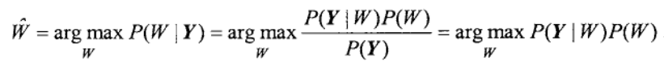
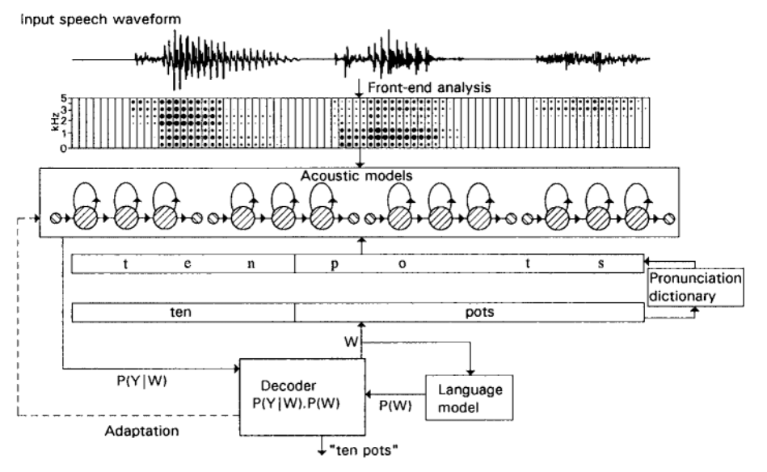
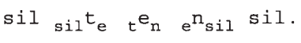
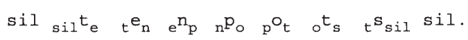

# Automatic Speech Recognition for Large Vocabularies

## ARPA traditional approach

1. The first stage began by detecting phonetic features (e.g. formant frequencies, energy in different frequency bands, etc.) that were known to be important for distinguishing different speech sounds.

2. Rules were used to convert from the measured features to a hypothesized phonetic transcription, which usually included some alternatives.

3. The second stage then converted this
transcription to a recognized word sequence.

4. Inevitably there would be errors in the
initial phonetic transcription, but the hope was that these errors would be corrected by
the higher-level post-processing.

5. However, in practice the first stage was so error-prone
that information was lost which could not be recovered later. As a consequence, all the
systems using this knowledge-based approach gave disappointing performance.

### Model that worked

based on a systematic search of a large network of states with strong syntactic
constraints, and it was one of the early large-vocabulary speech recognition systems using HMM.

System was developed at CMU by Lowerre (1976) as a Ph.D. project, extending the earlier pioneering
work on HMMs by Baker (1975).

### Outcome of ARPA

Demonstration of the benefits
of data-driven statistical pattern matching over knowledge-based methods

Principle of delayed decision making is crucial, as it allows the overall best solution
to be found incorporating all constraints, including those on construction of individual
words and on allowed word sequences.

This principle is fundamental to the design of all
modern large-vocabulary speech recognizers.

### Later
Concurrent with the ARPA projects, research was in progress at IBM on the use of
statistical methods for ASR.

Work at
IBM continued with an emphasis on applying HMMs to large-vocabulary speech
recognition, and in the early 1980s the group focused on developing a system for
**dictation of office correspondence** (This process allows the author to verbally convey their message, while the transcriptionist or software converts the spoken words into text)

Resulting system, “Tangora” , was a speaker-dependent, isolated-word, near-real-time recognizer with a
5,000-word vocabulary. Although this system required users to leave pauses between
words, it established the principles underlying the use of HMMs for a large-vocabulary
task.

## SPEECH TRANSCRIPTION AND SPEECH UNDERSTANDING

1. Speech transcription: The user wishes to know exactly what the speaker said, in the
form that it would be transcribed by an audio typist to produce orthographic text.

2. Speech understanding: The semantic content of the message is required, and any
recognition errors do not matter. As the real requirement is for the system to perform the correct action.

Speech-understanding tasks, together with the fact that the
subject area is often restricted, means that the relevant vocabulary at any one point can be much smaller than the total vocabulary that is needed for more general transcription
tasks. However, in order to interpret meaning of utterances, more detailed syntactic and
semantic analyses are necessary when just transcribing the words that
were spoken.

The principles of large-vocabulary recognition using HMMs apply both to
transcription and to understanding,

---

## SPEECH TRANSCRIPTION

1. Input speech waveform (typically sampled at 16 kHz) is first analysed into a
sequence of acoustic feature vectors such as MFCCs.

2. Once the input speech has been analysed into a sequence of feature vectors, the
recognition task is to find the most probable word sequence W given the observed vector
sequence Y.

3. Bayes’ theorem : task of
finding a word sequence, the most probable sequence can be derived from the probability
P(W|Y) of any one sequence W.

    - States that the most likely word sequence is the one which maximizes the
product of P(Y|W) and P(W)
    - The first term denotes the probability of observing vector
sequence Y given the word sequence W^ : **acoustic model**
    - Second term represents the probability of observing word sequence W independently from
the acoustic signal, and is determined by a **language model**.
    - Acoustic-model probabilities, which is fundamental to any speech
recognition system based on statistical models.
    - Language-model probability is also a major factor in obtaining good
performance: restrictions imposed by the language model can greatly reduce the number
of different alternatives to be distinguished by the acoustic model.

## Working

In order to calculate the acoustic-model probability P(Y|W), a composite model for the word sequence is generated. Rather than having a separate
HMM for each word, the component models represent phone-size units and a
pronunciation dictionary is used to specify the sequence of models for each word in the
vocabulary.

The dictionary is used to look up the required
sequence of phone models for each word, and these phone models are concatenated
together to form the model for the word sequence.

The probability of that model
generating the observed acoustic sequence is calculated, and this probability is multiplied
together with the language-model probability. In principle, this process can be repeated
for all possible word sequences allowed by the language model, with the most likely
sequence being selected as the recognizer output.

## CHALLENGES POSED BY LARGE VOCABULARIES

1. In continuous fluent speech, there are many instances when words cannot be distinguished
based on acoustic information alone and it is necessary to rely on a language model for
discrimination. 

    - co-articulation between adjacent words, word boundaries are not usually apparent in the acoustic signal
    - two utterances may be linguistically
different but acoustically very similar or even identical (as in the “grey day” versus “grade A”)

2. Memory and computation requirements can become excessive . Determining the
choice of search mechanism for use in decoding.

3. As the vocabulary size increases, it becomes increasingly difficult to provide enough
representative examples of all the words. Both, text to train the language model and
as spoken examples to train the acoustic model.

--- 

## ACOUSTIC MODELLING

- With a large vocabulary, it is
impractical to expect any one person to provide enough examples to train models for all the
words from scratch, even if the system is intended for speaker-dependent operation. Hence, a speaker-independent model set is used.
- That person can be required to speak some specific utterances, which can be used for
supervised model adaptation before the person uses the system to perform any real task.
- Even with several speakers to provide the data, it is not practical to train a separate
model for each word in a large-vocabulary system.
- As it does not take account of the fact that different
words can share sub-components. Therefore large-vocabulary systems are based on sub-
word models.
- use models of phone-size
units, with the sequence of phones for each word being specified in a pronunciation
dictionary. Thus, the requirement for the training is to provide sufficient examples of all the
phone-size units, and all the words in the vocabulary will not necessarily have occurred in
the training data.
- suitable models are available, words can be added to the
vocabulary at any time simply by extending the pronunciation dictionary.

### Context-dependent phone modelling

- As approximately 44 phonemes are needed to represent all English words, this number of
models would be the minimum needed to build word models for English.
- Effects of co-articulation are such that the acoustic realization of any one phoneme can
vary greatly with acoustic context. Therefore context-dependent HMMs are generally
used, with different models for different phonetic contexts.
- Although alternative
pronunciations can be included in the dictionary, it is difficult to include every possible
pronunciation and any that are not covered will need somehow to be accommodated in
the chosen set of context-dependent HMMs.
- The simplest and most popular approach is to use **triphones**, whereby every
phone has a distinct HMM for every unique pair of left and right neighbours.
    - Example, consider the word “ten”. When spoken in isolation, this word could be
represented by the sequence  `sil ten sil` , with the `sil` model being used for `silence` at
the start and end.
 Using triphones, with the notation y to denote phone y preceded
by phone x and followed by phone z, the word would be modelled as:

    - Consider example: `ten pots`
    
    The two instances of the phone [t] are represented by different models because their
contexts are different.
    - For example, if the phrase were “ten dogs”, the last triphone used to
    model “ten” would be end
    rather than enp.
    This use of **cross-word triphones** enables co-articulation effects across word boundaries to be accommodated.

The decoding task can be greatly simplified by using only **word-internal triphones**,whereby ‘word boundary’ acts as a context and so the sequence of HMMs is fixed for each
word.

- example the triphones enp and npo would be replaced by en and po
respectively, with being used to represent a **word boundary**.

- Probabilities for these triphones can be estimated by ‘backing off
or interpolating with biphones (dependent on only the left or the right context) or even
context-independent monophones.

# SUMMARY

The purpose of the language model is to incorporate language constraints, expressed
as probabilities for different word sequences.

N-grams model the probability of a word depending on just the immediately
preceding N-1 words, where typically N=2 (‘bigrams’) or N=3 (‘trigrams’)

The principles of HMM recognition extend to large vocabularies, with a multiple-
level structure in which phones are represented as networks of states, words as
networks of phones, and sentences as networks of words.

In practice the decoding
task is not straightforward due to the very large size of the search space, especially if
cross-word triphones are used. Special treatment is also required for language models
whose probabilities depend on more than the immediately preceding word (i.e. for
models more complex than bigrams). 

The one-pass Viterbi search can be extended to
operate with cross-word triphones and with trigram language models, but the search space becomes very large and is usually organized as a tree. Efficient pruning is
essential.

An alternative search strategy uses multiple passes. The first pass identifies a
restricted set of possibilities, which are typically organized as an N-best list, a word
lattice or a word graph. Later passes select between these possibilities. Another option
is to use a depth-first search.

