# Introduction

- Use of Information and Communication Technologies (ICT) in Personal Protective Equipment (PPE) has improved workplace safety 
- Added features environmental sensing and risk identification
- Mine workers are at risk of health problems and death due to toxic gases and changes in ambient conditions, but traditional warning systems are ineffective.
- A proposed real-time surveillance helmet that uses IoT sensors to detect harmful gases, dust, temperature, and more, with a built-in GPS tracker, will reduce the number of workplace accidents and deaths.
- The accuracy of the proposed prototype has been evaluated in three working environments, with an accuracy of approximately 96-99%.

# Proposed Methodology

Newly upgraded prototypes have been designed to overcome the existing limitations. The three-tier architecture of the proposed prototype for monitoring miners’ health.

# 

## Sensing Unit

This tier act as a base for monitoring and alerting system. The
objective of this tier is to sense the individual health parameters
(body temperature and heartbeat) and individual nearby environment
parameters (environment temperature, air quality, silica dust particle,
fire, and humidity). All these parameters are measured using ambient
light weight sensors mounted on the helmet.

### **1. Heartbeat sensor**

collect the heart rate information of the
user. Workers may undergo some panic situations during mining due
to various environmental changes. Hence, a change in heart rate alert
will help the rescue team take early actions to avoid accidents.

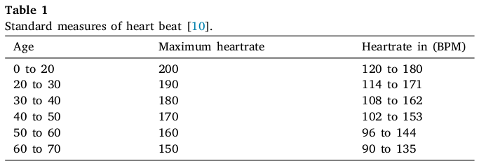

### **2. Gas Sensor (MQ135)**

here are various gaseous pipelines
leakage or may be due to some chemical effects, hazardous gases
like carbon monoxide, Ammonia, and many others may get generated.
Hence, it will make it difficult for anyone to work under such condi-
tions. This sensor will provide information that present conditions are
suitable for working or not. Even after crossing a threshold limit related
to these harmful gases, it will generate an alarm to save the life of workers.

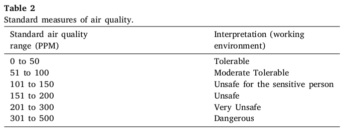

### **Working**

The gas sensor module consists of a steel exoskeleton under which a sensing element is housed.
This sensing element is subjected to current through connecting leads. This current is known as
heating current through it, the gases coming close to the sensing element get ionized and are
absorbed by the sensing element. This changes the resistance of the sensing element which
alters the value of the current going out of it.
Used in air quality control equipment for buildings/offices, is suitable for detecting
of NH3, NOx, alcohol, Benzene, smoke, CO2, etc.

The following are the mathematical formulae used by the IoT
sensors to compute the individual’s nearby environmental parameters.

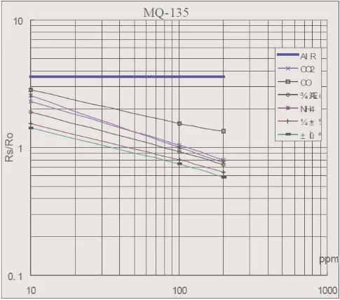

Ro is the sensor resistance at 100ppm of NH3 in clean air, and Rs is the sensor resistance at various concentrations of gases.

 Rs is the resistance of the sensor that changes depending on the concentration of gas, whereas Ro is the resistance of the sensor at a known concentration without the presence of other gases, or in the fresh air.
The fact that the Rs/Ro ratio is a constant in clean air.
 The scale is log-log i.e. in a linear scale, the behavior of the gas concentration with respect to the resistance ratio is exponential (not linear)

Using the library-supported [Arduino setup](https://github.com/GeorgK/MQ135), MQ-135 gas sensor calibration is done at first by finding the value of Ro in fresh air, and then using that value to find Rs through the formula:

Rs = (Vcc/VRL-1)x RL

Rs = (5V/(sensorValue * (5.0/1023.0))-1)*RL

Value of the load resistor (RL) about 20KΩ (10KΩ to 47KΩ).

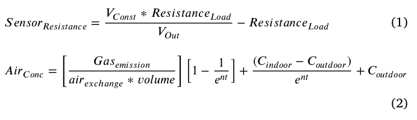

        𝑛 = Q/volume,
        𝑉𝐶𝑜𝑛𝑠𝑡 is Constant Value = 5,
        𝐴𝑖𝑟𝐶𝑜𝑛𝑐 is CO2 Concentration air,
        𝐺𝑎𝑠𝑒𝑚𝑖𝑠𝑠𝑖𝑜𝑛 is CO2 Emission (1/min),
        𝑎𝑖𝑟𝑒𝑥𝑐ℎ𝑎𝑛𝑔𝑒 is Air exchange per hour,
        𝑒 is Constant value 2.1718,
        𝑡 is time in minutes,
        𝐶𝑖𝑛𝑑𝑜𝑜𝑟 is CO2 concentration indoor,
        𝐶𝑜𝑢𝑡𝑑𝑜𝑜𝑟 is CO2 concentration outdoor

### **3. Optical dust sensor (GP2Y1010AU0F)**

This sensor is composed of a phototransistor and infrared emitting
diode. It identifies the light reflected by the dust particle. This sensor
is capable enough to identify fine dust particles like smoke, cigarette
hash, house dust, etc.
describes the standard measures of air
dust. As shown in the tables below, the definitions of various
symbols are computed 

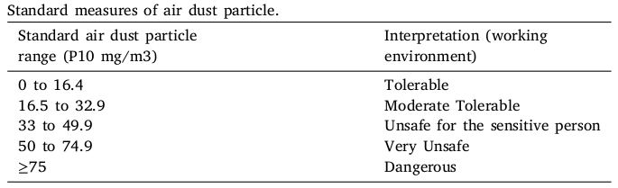
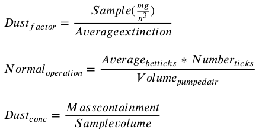

𝐴𝑣𝑒𝑟𝑎𝑔𝑒𝑏𝑒𝑡𝑡𝑖𝑐𝑘𝑠 is the number of dust elements between two
subsequent ticks,

𝑁𝑢𝑚𝑏𝑒𝑟𝑡𝑖𝑐𝑘𝑠 is total ticks 

𝑉 𝑜𝑙𝑢𝑚𝑒𝑝𝑢𝑚𝑝𝑒𝑑𝑎𝑖𝑟 is air
volume.

### **4. Temperature and humidity sensor (DHT11)**
It is a digital, low-cost humidity, and temperature sensor. It utilizes
a thermistor and capacitive sensor for quantifying the humidity, and
temperature of surrounding environment in the form of digital signals.

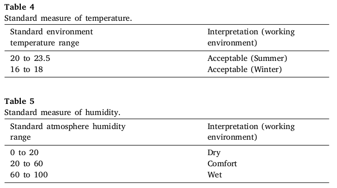

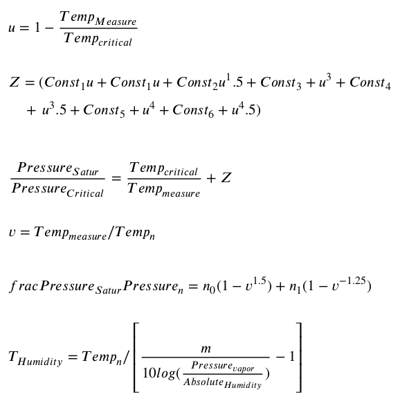

𝑇 𝑒𝑚𝑝𝑀𝑒𝑎𝑠𝑢𝑟𝑒 is Temperature, 𝑃 𝑟𝑒𝑠𝑠𝑢𝑟𝑒𝑆𝑎𝑡𝑢𝑟 is Saturation pressure,

𝑇 𝑒𝑚𝑝𝐶𝑟𝑖𝑡𝑖𝑐𝑎𝑙 is Critical temperature 647.096 (K),

𝑃 𝑟𝑒𝑠𝑠𝑢𝑟𝑒𝐶𝑟𝑖𝑡𝑖𝑐𝑎𝑙 Critical
Pressure 220640 (hpa), 

𝐶𝑜𝑛𝑠𝑡1 is −7.85951783,

𝐶𝑜𝑛𝑠𝑡2 is 1.84408259,

𝐶𝑜𝑛𝑠𝑡3 is −11.7866497,

𝐶𝑜𝑛𝑠𝑡4 is 22.6807411,

𝐶𝑜𝑛𝑠𝑡5 is −15.9618719,

𝐶𝑜𝑛𝑠𝑡6 is 1.80122502,

𝑇𝑒𝑚𝑝𝑛 is Temperature (triple point) 273.16 K,
(triple point of a substance is the temperature and pressure at which the three phases (gas, liquid, and solid) of that substance coexist in thermodynamic equilibrium.)

𝑃𝑟𝑒𝑠𝑠𝑢𝑟𝑒𝑛 is Pressure vapor at 𝑇 𝑒𝑚𝑝𝑛 ,

𝑃𝑟𝑒𝑠𝑠𝑢𝑟𝑒𝑆𝑎𝑡𝑢𝑟 is Pressure vapor
saturation,

𝑛0 is-13.928169, 𝑛1 34.707823,

𝑇𝐻𝑢𝑚𝑖𝑑𝑖𝑡𝑦 is Humidity and

𝐴𝑏𝑠𝑜𝑙𝑢𝑡𝑒𝐻𝑢𝑚𝑖𝑑𝑖𝑡𝑦 is Absolute humidity.

### **5. Flame sensor (YG1006)**

Flame Sensor — 5 mm IR Diode can work as a fire detection flame
sensor module, fire source detection modules. This Flame Sensor can
be used to detect fire sources or other light sources of the wavelength
in the range of 760 nm–1100 nm. It is based on the YG1006 sensor
which is a high speed and highly sensitive NPN silicon phototransistor.
Due to its black epoxy, the sensor is sensitive to infrared radiation. It
can be used as a flame Sensor for Smart Car. It gives analog results like
i.e., 0 for no fire and 1 for fire or a light source of wavelength in range
760 nm–1100 nm is detected.

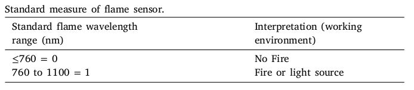

### **6. Respiratory filter (P95) and other**

P95 respirator filters filter 99.97 percent of all particles at least
0.3 μm in diameter and oil proof, which prevents the inhaling of coal
dust and silica dust. These sensors are embedded on helmet along with an RFID tag and reader is utilized to trace the live
location and an LCD screen to show the real-time values detected by
these sensors.
The power supply to the complete systems is given by the battery
installed as overall power consumption is not so high to operate these
sensors. These IoT devices are lightweight and mounted on the surface
of the helmet in such a way that it will not give a heavier object feeling
on the head.

#
## Computing Unit
This tier comprises IoT gateways. The responsibility of this tier is to
communicate both sensing and monitoring tier, i.e., gather data from
the sensing layer, after processing, transfer the data to the monitoring
layer.

### **System architecture**
System architecture comprises three units, Transmitting, Receiving, and Central Unit. 

* The Transmitting unit consists of temperature,
humidity, heartbeat, gas, flame, and optical dust sensors. 
All these
sensors are connected to Arduino Uno, power supply, RFID reader,
and nRF1 transmitter module.

* The Receiving Unit consists of an nRF2
receiver that receives the sensor’s value, GSM/GPRS.

* The Central Unit
consists of nRF3 and ESP8266 Wifi modules to save a miner worker’s
health report for future reference on the cloud. This tier comprises
IoT gateways. The responsibility of this tier is to communicate both
sensing and monitoring tier, i.e., gather data from the sensing layer,
after processing, transfer the data to the monitoring layer.

Here microcontroller acts as a master while nRF1 acts as an en-
slaved person. The microcontroller gets the value from all the
sensors and processes to determine the working environment’s
nature. For communicating with the receiving unit, nRF1 is used.
Master–slave architecture is followed by the microcontroller and
by the nRF1. After receiving the request (for sending environ-
mental and miner’s health condition to receiving unit) from the
masters, enslaved person, i.e., nRF1, gathers the sensors value
and transfer it to nRF2 of the receiving unit.The
architecture of receiving unit. nRF2 receives the values from
the transmitting unit. This unit performs two kinds of activities.
Firstly, it sends the values to the nRF3 to save the miners’
health condition for future use. Secondly, based on the environ-
ment type, necessary action is performed, i.e., by sharing the
environmental condition and the location of the miners to the
monitoring. The architecture of the central unit. This
unit is responsible for gathering the miner’s environmental and
health conditions.

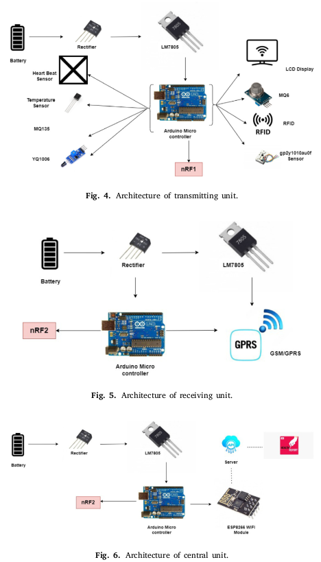

### **1. RFID Tag and Reader**

RFID technology involves two components, i.e., RFID tags and
RFID readers. RFID tags are made up of an antenna and the
integrated circuits (IC) responsible for sending data to the RFID
reader. RFID tags are made up of plastics with unique tags
(identification number or name) embedded within the layers.
The RFID readers convert radio signals to helpful information;
this information is transferred to the communicating host system
to locate the real-time position on the miner.

### **2. nRF24L01 Module**

This module utilizes 2.4 GHz with 250 Kbps–2 Mbps speed. It
covers up to 100 meters of area. It could utilize 125 unique
channels that allow having a system of 125 freely functioning
devices in a single region. Every path could have six addresses.
Each unit can speak with six different units. Meanwhile, 12 mA
is the power utilization of this module in between communication, which is lower than an LED. 1.9 to 3.6 V is the working
voltage of the module. However, the best part is that alternate
nodes endure 5 V logic. Thereby, without using any logic-level
converters, we could easily interface it to an Arduino.

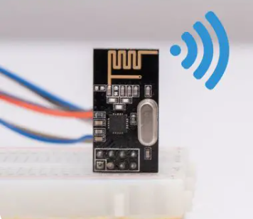

### RF Channel Frequency

The nRF24L01+ module transmits and receives data on a specific frequency known as a channel. For two or more modules to communicate with each other, they must be on the same channel. This channel can have any frequency in the 2.4 GHz ISM band, or more precisely, any frequency between 2.400 and 2.525 GHz (2400 to 2525 MHz).
Each channel takes up less than 1 MHz of bandwidth. This gives us 125 possible channels with a 1MHz spacing.
This means that the nRF24L01+ can operate on 125 different channels, allowing you to build a network of 125 independently operating modems in one location

### Multiceiver

The nRF24L01+ includes a feature known as **Multiceiver**. It stands for Multiple Transmitter Single Receiver.
In a multiceiver network, each RF channel is logically divided into six parallel data channels known as data pipes. In other words, the data pipe is one of six logical channels within a single physical RF channel. Each data pipe has its own unique address, known as a data pipe address. Only one data pipe can receive a packet at a time

### Reference
The LM7805 is a voltage regulator that outputs +5 volts

## Monitoring Unit
This tier has two kinds of responsibilities. The first responsibility
is to store the reading of the sensors and the environment type
(determined by the computing unit) in the cloud database. The
second responsibility is to generate an alert message to the
monitoring and the rescue team, and the miner’s live location
when the environment type is non-preferable.

The sensors are mounted on the helmet, which detects the
individual health parameters (body temperature and heartbeat)
and individual’s nearby environments parameters (environment
temperature, presence of silica dust particle, fire, humidity, and
presence of harmful gases). The captured real-time parameters
values are saved in the cloud for future health analysis of the
miner worker. The captured values are further used to determine
the nature of the working environment, i.e., preferable or non-
preferable. If the working environment is preferable, sensors
start capturing health parameters and environment parameters
again. The predefined threshold value is set in the systems;
for example, the buzzer will generate 1000 PPM for pollution
indication on violation an alert.Purpose of this model is to reduce the number of accidents and deaths of mining workers. On the other hand, in
emergencies, a rescue team will get an alert with a live location
to rescue the victim.

## Case

### 1. **Case 1: Let us consider a scenario when Temperature-20 ◦ C Air ppm-350 ppm Heart rate-175 Dust Particle-18 Humidity-19 Flame-0**

Proposed invention: It will read data through sensors; in this
case, threshold values are normal. Thus, the system will function
normally, and meanwhile, data will be sent to the cloud in real-
time, which will be recorded for further analysis and report
generation.

**SYSTEM- Preferable**

### 2. **Case 2: Let us consider a scenario where Temperature-20 ◦ C Air ppm-< 2000 ppm Heart rate-175 Dust Particle-27 Humidity-50 Flame-0**

it will read data through sensors; in this
case, the threshold values of the Gas Sensor exceed normal. Thus,
the Gas Sensor will be triggered as the ppm value is greater than
the threshold value. The system will detect poisonous gas, and a
fuzzy inference system determines the environment type. If the
environment type is non-preferable, it will trigger a message to
generate an immediate alert through Buzzer and send a message
to the cloud to generate an alert (message and live location of
the miner) to the monitoring and rescue team.

**SYSTEM- Non-Preferable (Poisonous Gas), alerts generated.**

### 3. **Case 3: Let us consider a scenario where Temperature-30 ◦ C Air ppm-350 ppm Heart rate-300 Dust Particle-55 Humidity-50 Flame-0**

it will read data through sensors; in this
case, threshold values are exceeded than normal. In this case,
the fuzzy inference system determines the environment type.
If the environment type is non-preferable, it will immediately
determine that individual worker health is not normal. It will
trigger a message to the cloud for generating an alert to the
monitoring and rescue team regarding Health issues of miners.
Note: Gas Sensor measures the reflection and absorption of
infrared light while interacting with hazardous gases.

**System: Non-Preferable (Not Well, Needs to Rest or Needs to see Doctor). Alerts generated**

### 4. **Case 4: Let us consider a scenario where Temperature-30 ◦ C Air ppm-< 2000 ppm Heart rate-300 Dust Particle-55 Humidity-50 Flame-0**

Proposed Invention: it will read data through sensors; in this
case, the threshold values of the Gas Sensor exceed normal.
Thus, the Gas Sensor, Heart Sensor and Dust Particle will be
triggered as the gauged value is greater than the threshold
value. The system will detect poisonous gas, dust particle, and a
fuzzy inference system determines the environment type. If the
environment type is non-preferable, it will trigger a message to
generate an immediate alert through Buzzer and send a message
to the cloud to generate an alert (message and live location of
the miner) to the monitoring and rescue team.

**SYSTEM- Non-Preferable (Poisonous Gas Not Well, Needs to Rest or Needs to see Doctor), alerts generated.**

# Experimental Setup and Results

The proposed prototype comprises of multiple senors, for sensing multiple parameters. A controller for receiving real-time data from the sensors where data is compared with threshold values of each parameter for generating alerts and warning.

It is an IoT-based system and comprises a wireless communication
module for wireless transmission of real-time data from multiple sensors to a server in a cloud network. The system is
configured to generate warnings for at least three conditions in the
mine.

The proposed prototype is evaluated in three different environmental setups, i.e., indoor, outdoor, and coal mines.

The efficiency of the proposed prototype:
i) indoor environment setup is conducted in a
small room in which only one person is present. This evaluation process
is carried out for nine days, with 53 readings per day.

ii) The outdoor environment setup is conducted in the industry (plastic industry) for nine days of 65 readings per day.

iii) The coal mines environment setup
is conducted in coal mines for three days of 199 readings per day.

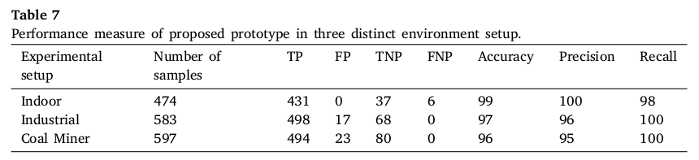

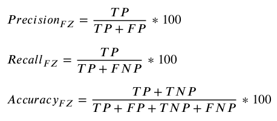

## In comparision to Sattar, performance measured in three scenarios 

Sattar H : [An intelligent air quality sensing system for open-skin wound monitoring](https://scholar.google.com/scholar_lookup?title=An%20intelligent%20air%20quality%20sensing%20system%20for%20open-skin%20wound%20monitoring&publication_year=2019&author=H.%20Sattar&author=I.S.%20Bajwa&author=U.F.%20Shafi)

# 

# References

1. [Codrey Blog for Gas Sensor](https://www.codrey.com/electronic-circuits/how-to-use-mq-135-gas-sensor/)

2. [Wikipedia Triple point](https://en.wikipedia.org/wiki/Triple_point)

3. ["last minute engineers" for module details](https://lastminuteengineers.com/)